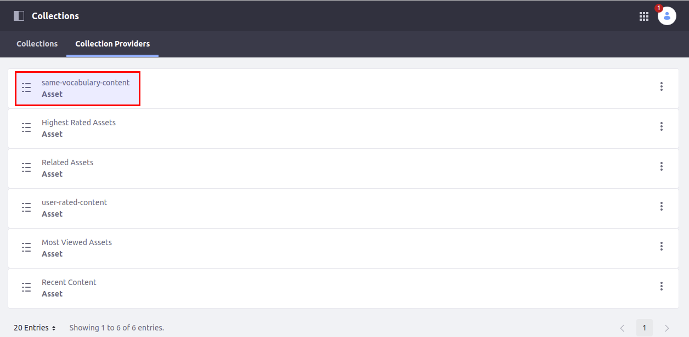
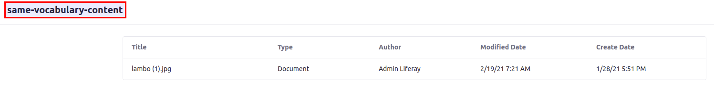
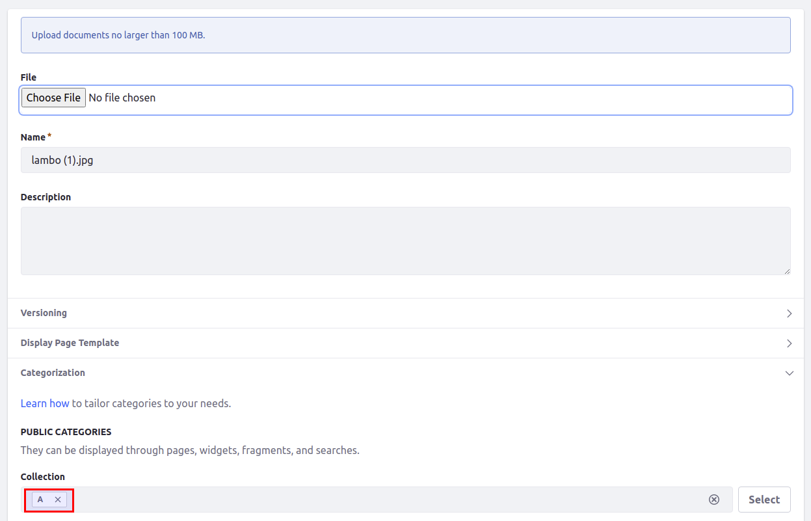
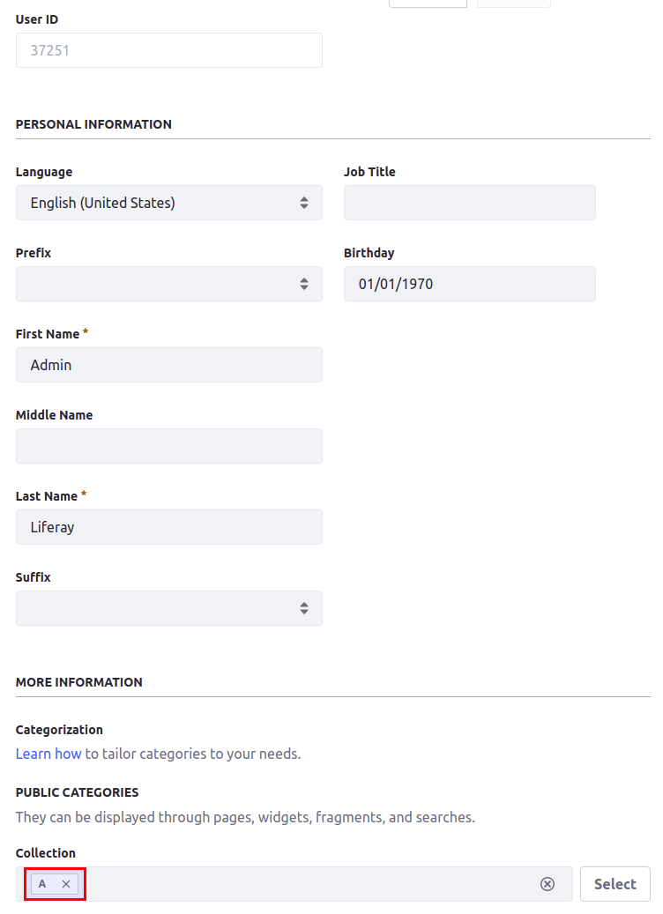

# SameVocabulary Items Collection Provider

This is an example of a collection provider.
This provider will select only content that has at least one of the same categories as the user.
Currently it only supports files in the Document&Media Library.

Based upon a case where the customer-specific manuals should be seen by the customer

Developed to run on the following versions of Liferay: `Liferay DXP 7.3`

Built with [Liferay Workspace](https://help.liferay.com/hc/en-us/articles/360029147471-Liferay-Workspace) and [Blade CLI](https://help.liferay.com/hc/en-us/articles/360029147071-Blade-CLI).






## How to Build and Deploy to Liferay

Follow the steps below to build and deploy or copy the modules from the [releases](../../releases/latest) page to your Liferay's deploy folder.

In order to build or deploy this module you will need to [install Blade CLI](https://help.liferay.com/hc/en-us/articles/360028833852-Installing-Blade-CLI).

### To Build

`$ blade gw build`

You can find the built modules at `modules/{module-name}/build/libs/{module-name}.jar`.

### To Deploy

In `gradle-local.properties` add the following line to point towards the Liferay instance you want to deploy to:
```
liferay.workspace.home.dir=/path/to/liferay/home
```

`$ blade gw deploy`

## Usage

1. Create a vocabulary with some categories
1. In the user profile select one or more categories from this vocabulary
1. In the document & media library add on or more of these categories
1. Get a preview of the SameVocabulary Items Collection Provider to see whether it works
1. Now you can use this collection provider with the Asset Publisher widget to show user specific documents/files 

### Features

* Map user categories to files with the same categories

## Issues & Questions Welcome